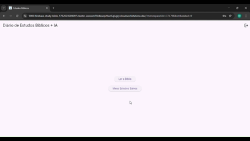

# App de Estudo Bíblico com IA

Um aplicativo móvel e web, construído com Flutter, que permite aos usuários ler a Bíblia, gerar estudos aprofundados com a ajuda da Inteligência Artificial da OpenAI e salvar esses estudos em uma biblioteca pessoal na nuvem.

 
<!-- TODO: Substitua pelo link de um GIF ou screenshot do seu app -->

---

## 🚀 Funcionalidades Principais

*   **Leitura da Bíblia (AA):** Navegue pelos livros e capítulos da Bíblia na tradução King James Version, fornecida pela API da [Bible4U](https://bible4u.net/).
*   **Estudo com IA:** Ao selecionar um versículo, o app envia o texto para a API da **OpenAI (gpt-3.5-turbo)**, que gera uma análise detalhada contendo:
    *   Contexto Histórico
    *   Análise Teológica
    *   Aplicação Prática
    *   Leitura Complementar com links para fontes confiáveis.
*   **Biblioteca Pessoal:** Salve seus estudos gerados. Eles são armazenados de forma segura no **Cloud Firestore**.
*   **Autenticação Segura:** Sistema completo de login e criação de conta com e-mail/senha via **Firebase Authentication**.
*   **Multiplataforma:** Funciona em **Android** e **Web**.
*   **Leitura de Artigos:** Links externos nos estudos são abertos no navegador padrão, garantindo compatibilidade total.

---

## 🛠️ Tecnologias e Arquitetura

*   **Framework:** [Flutter](https://flutter.dev/)
*   **Linguagem:** [Dart](https://dart.dev/)
*   **Backend e Autenticação:** [Firebase](https://firebase.google.com/) (Authentication, Cloud Firestore)
*   **API da Bíblia:** [Bible4U API (AA)](https://bible4u.net/api/v1/bibles/AA)
*   **Inteligência Artificial:** [OpenAI API (gpt-3.5-turbo)](https://platform.openai.com/)
*   **Gerenciamento de Segredos:** `flutter_dotenv`
*   **Renderização de Texto:** `flutter_markdown`
*   **Links Externos:** `url_launcher`

A arquitetura do projeto é dividida em:
-   `lib/models`: Contém os modelos de dados (`BookModel`, `VerseModel`, `StudyModel`).
-   `lib/pages`: Contém todas as telas da aplicação.
-   `lib/services`: Isola a lógica de comunicação com as APIs externas (Firebase, OpenAI, Bible4U).
-   `lib/widgets`: Armazena componentes de UI reutilizáveis.

---

## ⚙️ Configuração do Ambiente

Para rodar este projeto localmente, siga os passos abaixo:

**1. Pré-requisitos:**
*   Ter o [Flutter SDK](https://flutter.dev/docs/get-started/install) instalado.
*   Ter uma conta no [Firebase](https://firebase.google.com/) e criar um novo projeto.
*   Ter uma chave de API da [OpenAI](https://platform.openai.com/).

**2. Clone o Repositório:**
```bash
git clone https://github.com/mylenosa/bible_study_app.git
cd bible_study_app
```

**3. Configure o Firebase:**
*   Instale a CLI do Firebase: `npm install -g firebase-tools`
*   Instale a CLI do FlutterFire: `dart pub global activate flutterfire_cli`
*   Execute o comando de configuração e siga as instruções, selecionando seu projeto Firebase e as plataformas (android, web):
    ```bash
    flutterfire configure
    ```
*   Isso irá gerar o arquivo `lib/firebase_options.dart` e configurar os arquivos nativos.

**4. Configure a Chave da OpenAI:**
*   Na raiz do projeto, crie um arquivo chamado `.env`.
*   Dentro deste arquivo, adicione sua chave da OpenAI no seguinte formato:
    ```
    OPENAI_API_KEY=sua_chave_secreta_da_openai_aqui
    ```
*   **Importante:** O arquivo `.env` já está no `.gitignore` para garantir que sua chave não seja enviada para o repositório.

**5. Instale as Dependências:**
```bash
flutter pub get
```

**6. Configure as Regras de Segurança do Firestore:**
*   No seu console do Firebase, vá para **Firestore Database > Rules**.
*   Substitua as regras existentes por estas para garantir que os usuários só possam acessar seus próprios estudos:
    ```json
    rules_version = '2';
    service cloud.firestore {
      match /databases/{database}/documents {
        // Permite que um usuário acesse apenas a sua própria subcoleção de estudos
        match /users/{userId}/studies/{studyId} {
          allow read, write, delete: if request.auth.uid == userId;
        }
      }
    }
    ```

**7. Rode o Aplicativo:**
*   **Para Android:**
    ```bash
    flutter run -d emulator-5554
    ```
*   **Para Web:**
    ```bash
    flutter run -d chrome
    ```

---

## 🤝 Contribuições

Contribuições são bem-vindas! Se você encontrar um bug ou tiver uma sugestão de melhoria, sinta-se à vontade para abrir uma *issue* ou enviar um *pull request*.
